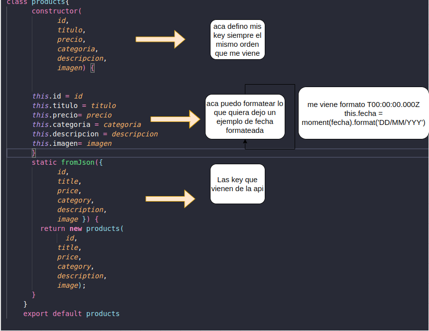
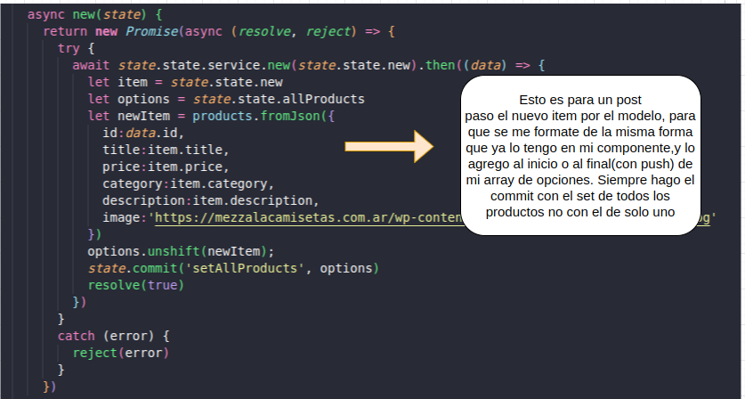

# mvc

## Project setup
```
npm install
```

### Compiles and hot-reloads for development
```
npm run serve
```

### Compiles and minifies for production
```
npm run build
```

### Customize configuration
See [Configuration Reference](https://cli.vuejs.org/config/).


##  Datos para el modelo MVC

-SIEMPRE hago un modelo por cada endpoint get que tenga, un servicio para cada categoria, ejemplo si tengo productos , el get , el patch, delete y post todos en un mismo servicio y store. No mezclo productos con categorias. Así es mas organizado y se entiende mejor.

-Me fijo que es lo que me trae la api, si las key estan en español o en ingles y si me conviene hacer cambios o no. Siempre es conveniente trabajar con las key que nosotros queremos para poder formatearlas siempre que querramos. Por ejemplo. Si viene una fecha en formato T00:00:00.000Z nosotros al tener el modelo podemos formatearlo para que nos quede 00/00/00 . Sin tocar los componentes. 
Si nos piden de cambiar una key de algun endpoint solo voy al modelo que tengo que cambiar y cambio solo lo que me trae la api, no modifica lo que yo ya puse. 


- Una vez que tengo el modelo armado, voy al servicio, cuando hago el pedido GET, le voy a decir que por cada item que me venga pase por mi modelo, para que se formate las key como yo quiero. 

.get(`${url}`)
              .then(({ data }) => {
                return data.map((item) => {
                  return products.fromJson(item);  --> va al modelo
                });
              });


-Luego voy al store, trato de en las mutaciones solo setear lo que en los componentes haga con las variables de estado. No hago modificaciones en las mutaciones. Ya que se me va a dificultar cuando tenga que cambiarle algo a esa variable. Yo las modificaciones las hago en el componente que quiera, le paso la variable por set --> nombreDelStore.commit('setProducto', variable a modificar)
entonces en el store mutation hago --> setProducto(state,data){ state.producto = data} --> el data es la variable a modificar que mande del componente. 
Y en las acciones, hago la llamada al servicio .


-En el componente, voy a llamar en propiedades computadas a los estados iniciales del store , por ejemplo 
allProducts() {
                  return products.state.allProducts
            },
!OJO¡ --> Hay que hacer el dispatch siempre que quieras llamar a el estado del store. Para que haga el pedido a la api y me traiga lo que quiero. En este caso lo hago en el monted 
 products.dispatch('getProducts')